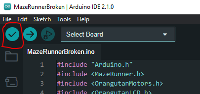
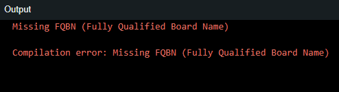

# https://github.com/Brewhan/MazeRunner/
- Arduino IDE
    - Library Manager -> Pololu3piPlus32U4
-Clone the Repo

- Easy Installation:
    - run `install.bat`
    
- Manual Installation:
   - Copy all the folders within `/libs` into `/Documents/Arduino`
   - Copy the `/MazeRunnerBroken` folder into `/Documents/Arduino`
- From `/Documents/Arduino/MazeRunnerBroken/` open `MazeRunnerBroken.ino`

# Run Guide

## This guide will assist with running the code on the device and  common issues encountered when trying to run your code on the device. Please feel free to add your own thoughts here.
#
## Sample Pre-requisites
- Arduino IDE
    - Library Manager -> Pololu3piPlus32U4
-Clone the Repo
   - Copy all the folders within `/libs` into `/Documents/Arduino`
   - Copy the `/MazeRunnerBroken` folder into `/Documents/Arduino`
- From `/Documents/Arduino/MazeRunnerBroken/` open `MazeRunnerBroken.ino`
## Verify
Verifying your code will ensure that the code is will 'run' when placed on the device. This does not mean that the code is 'good', just that there arent any hard errors.
To verify your code, you can click the `tick` button at the top left of the Arduino IDE. Any errors will appear at the bottom of the ide in the `output`.

 
#
## Upload
To upload code, make sure your robot is `ON` by pressing the power button and plug your programmer into your 3pi Robot, using the 6pin adaptor provided. Next, Within Arduino IDE do `Sketch > Upload Using Programmer`. IMPORTANT!! do NOT unplug the device until you hear a beep from the programmer chip, otherwise you can damage the device. (Trust me here!)

#
## Getting Started with the Maze
When you are ready to start testing your code, you can place the robot at the start of the maze, and press the `B BUTTON` (middle button) at the back of the robot to initiate calibration. Once it has calibrated by turning left and right, press the same button again to start startup procedures, and again to start the motors.
&nbsp;
### IMPORTANT!!! Please do not block the motors when the robot is running. if you need to stop the device, carefully pick it up and press the power off button
&nbsp;

#
## Rerunning 
Once the robot has gotten to the end and stopped, first off congrats! - secondly - you may see some text along the lines of 'press c to runReduce'. This is the replay function. From here, place the robot at the start of the maze, and press the  `C BUTTON`. The C button is located to the right of the `B BUTTON` and at the back of the device.
#

## Help!
&nbsp;

## I'm missing libraries!
If missing, make sure you download the libraries in the Arduino IDE by searching for 3pi in the libraries manager.

&nbsp;

## What Board am I Using?
Selecting the board, the port, and programmer is necessary to get code running on the device. This may already be set up for you, but in case you lose this info, here's the rundown, you are using a Pololu 3pi robot w/ATmega328p, now in case this does not mean anything to you, I have diagrams to help:
## Board:

&nbsp;

## What Port Should I Choose?:
*This is where it can get interesting, usually when we run this, it is COM4, but on some devices this can turn into COM6/COM7/COM8/COM9 etc. - I can only advise you start with COM4 and then experiment to see which one actually works! In this example it is COM8. I know this because it disappears when I unplug the device. When you plug in the device, two extra COM entries will appear in this list. Make sure you choose the first of these two options!*

When you select the port, another dialogue box will appear and ask you to choose a board, please refer to the following:

## I can't upload code  /  What's a programmer?

*So you have this little device that plugs into the robot - this is your programmer. It is your `interface` between the computer and the robot, and it knows how to speak it's language! Make sure when you are uploading code to the language, you use this clever interpreter. To do so, you can use `Sketch > Upload Using Programmer`.*

In the odd case that your Arduino envrionment doesn't know what type of programmer you have, you can manually set it to `Atmel STK500 development board`. 

#
&copy; Andrew Ramsier 2023
